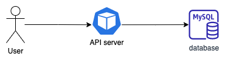
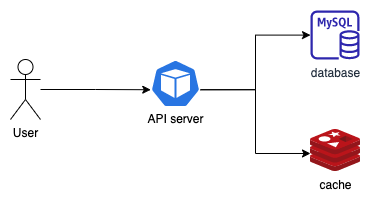

# kcd2021_helmfile

Simple app to demonstrate Helmfile in Kubernetes Community Days Indonesia 2021.

## Scenario

The app is very simple. It's just an API server that is retrieving frozen food data from the database. The app will be deployed to these two environments:
1. Staging
2. Production

### Staging

This environment is used by backend and QA engineers to develop and test their app. So that the traffic is not huge. The app will be deployed to kubernetes cluster along with its MySQL database. Every request from user will go directly to API server and the API server will try get data from MySQL.

### Production

This is real environment where the app is deployed to the public. A lot of people will use the API. The incoming traffic will be much bigger compared to staging. The stakeholders decided to add caching layer to keep the database not overloaded as well as serving data faster.

